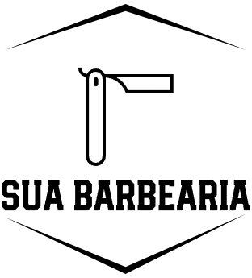

# Sua Barbearia - Agendamento e Gerenciamento

Sua Barbearia é uma aplicação móvel desenvolvida em React Native para dispositivos Android que permite agendar serviços em barbearias, gerenciar agendamentos e realizar pagamentos automaticamente. A aplicação se integra a um sistema de gerenciamento desenvolvido em Spring Boot para a gestão das barbearias e seus serviços.

## Funcionalidades

- **Agendamento de Serviços:** Os clientes podem agendar serviços em suas barbearias favoritas, escolhendo a data, horário e profissional de sua preferência.

- **Gerenciamento de Barbearias:** Proprietários de barbearias podem gerenciar suas operações, incluindo a criação e edição de serviços, a programação de horários e o acompanhamento de agendamentos.

- **Pagamento Automático:** A aplicação permite o pagamento automático dos serviços agendados, oferecendo uma experiência conveniente aos clientes.

## Licença

Este projeto está licenciado sob a Licença MIT - consulte o arquivo [LICENSE.md](LICENSE.md) para obter detalhes.
